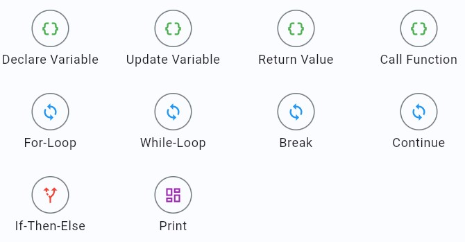
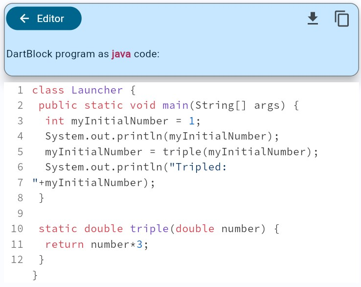

# DartBlock

- [DartBlock](#dartblock)
  - [Introduction](#introduction)
  - [Example](#example)
  - [Usage](#usage)
    - [Editor](#editor)
    - [Evaluator](#evaluator)
    - [Evaluation Result](#evaluation-result)
  - [Features](#features)
    - [Data Types](#data-types)
    - [Building Blocks](#building-blocks)
    - [Custom Functions](#custom-functions)
    - [Program Execution](#program-execution)
    - [Exceptions](#exceptions)
    - [Export to Java](#export-to-java)
    - [Program Evaluation](#program-evaluation)
    - [Serialization](#serialization)
  - [Supported Platforms](#supported-platforms)
    - [Web](#web)
  - [Documentation](#documentation)
  - [Assets](#assets)

## Introduction

A block-based programming framework, primarily designed for mobile devices.

In addition to a drag-and-drop based approach to composing programs, DartBlock also features several functionalities which are primarily meant to facilitate the framework's integration in the context of quizzes:

- **Automatic evaluation**: several schemas are available, based on which a user's program should be automatically checked for correctness.
- **Execution**: DartBlock programs can directly be executed on device to view their output.
- **Exceptions**: faulty programs can throw exceptions during their execution, which can help to teach debugging.
- **Difficulty tuning**: DartBlock offers levers to shuffle a given program's list of statements, as well as to trim it.
  - Example use case: to make a programming question based on DartBlock easier, part of the solution could be provided to the user, or the full solution could be provided but in a shuffled state.
- **Serialization**: with support for JSON encoding and decoding, DartBlock programs can be stored and reloaded.

## Example

<?code-excerpt "example/lib/main.dart (basic-example)"?>

```dart
import 'package:flutter/material.dart';
import 'package:dartblock_code/dartblock_code.dart';

void main() => runApp(
  const MaterialApp(
    home: Material(
      child: Center(
        child: CustomScrollView(slivers: [
            SliverFillRemaining(
              child: DartBlockEditor(
                key: ValueKey(NeoTechCore.example()),
                program: program,
                canChange: true,
                canDelete: true,
                canReorder: true,
                canRun: true,
              ),
            ),
          ]),
      ),
    ),
  ),
);

```

A more comprehensive working example can be found under `example/`.

## Usage

### Editor

The `DartBlockEditor` widget is the main component used for both rendering and editing a DartBlock program.

```dart
var program = DartBlockProgram.init([], []);
DartBlockEditor(
  key: ValueKey(program),
  program: program,
  canChange: true, // Create or edit statements/functions
  canDelete: true, // Delete existing statements/functions
  canReorder: true, // Re-order existing statements
  canRun: true, // Show "Run" button
  /// After a set amount of time (maximumExecutionDuration), DartBlock will
  /// automatically interrupt the execution of a DartBlockProgram.
  maximumExecutionDuration: Duration(seconds: 10), // default: 5s
  isDense = false, // default: false
  scrollController: null,
  onChanged: (changedDartBlockProgram) {
    // ...
  },
  onInteraction: (dartBlockInteraction) {
    // example: user tapped on "Run" button
    // Useful for statistics or logging
  },
  padding: const EdgeInsets.all(4), // default: null
)
```

<div align="center">
  
</div>

If you simply want to render a `DartBlockProgram` which the user can execute, but otherwise not modify, then use the following:

```dart
var program = DartBlockProgram.init([], []);
DartBlockEditor(
  key: ValueKey(program),
  program: program,
  canChange: false,
  canDelete: false,
  canReorder: false,
  canRun: true,
)
```

<div align="center">
  
</div>

### Evaluator

To set-up the evaluation schemas for a given `DartBlockProgram`, use the `DartBlockEvaluator` widget:

```dart
DartBlockEvaluator? evaluator;
DartBlockProgram sampleSolution = DartBlockProgram.init([], []); // Placeholder, your input program should not be empty.
DartBlockEvaluatorEditor(
  evaluator: evaluator,
  sampleSolution: sampleSolution,
  onChange: (evaluator) {
    setState(() {
      this.evaluator = evaluator;
    });
  },
)
```

This widget displays a dropdown button for selecting which evaluation schema to add to the `DartBlockEvaluator`, as well as the editors for each schema.

<div align="center">
  
</div>

### Evaluation Result

To display the evaluation of a given input `DartBlockProgram` using your sample solution `DartBlockProgram` and `DartBlockEvaluator`, use the `DartBlockEvaluationResultWidget` widget:

```dart
// DartBlockEvaluator evaluator = ...;
// DartBlockProgram sampleSolution = ...;
// DartBlockProgram inputProgram = ...;
FutureBuilder(
  future: evaluator!.evaluate( // evaluate() is an async function!
    sampleSolution,
    inputProgram,
  ),
  builder: (context, snapshot) {
    if (snapshot.connectionState == ConnectionState.active ||
        snapshot.connectionState == ConnectionState.waiting) {
      return const Center(
        child: Column(
          crossAxisAlignment: CrossAxisAlignment.stretch,
          mainAxisAlignment: MainAxisAlignment.center,
          mainAxisSize: MainAxisSize.min,
          children: [
            CircularProgressIndicator(),
            SizedBox(height: 4),
            Text("Evaluating..."),
          ],
        ),
      );
    } else if (snapshot.hasData) {
      return Column(
        crossAxisAlignment: CrossAxisAlignment.stretch,
        mainAxisAlignment: MainAxisAlignment.center,
        mainAxisSize: MainAxisSize.min,
        children: [
          Text(
            "Evaluation Result",
            style: Theme.of(context).textTheme.headlineSmall,
          ),
          SizedBox(height: 4),
          DartBlockEvaluationResultWidget(result: snapshot.data!), // Display result of evaluation
        ],
      );
    } else {
      return const Text(
        "Sorry, there was an issue evaluating your program.",
        textAlign: TextAlign.center,
      );
    }
  },
),
```

<div align="center">
  
</div>

## Features

### Data Types

- int
- double
- String
- boolean

### Building Blocks

The supported set of "blocks" or statement types.

- Variables
  - Declare Variable
  - Update Variable
- Loops
  - For-loop
  - While-loop / Do-while-loop
- Decision structures
  - If-then-else
- Print
- Function Call
- Return Value
- Break
- Continue
- <div align="center">
    
  </div>

### Custom Functions

In addition to the default main function which serves as the entry point of a DartBlock program, custom functions can also be defined, including:

- Return type ("void" included)
- List of parameters
- Name (unique)

<div align="center">
  
</div>

### Program Execution

DartBlock programs can be executed on device to verify their behavior and view their output.  
DartBlock is console-based, with support for "Print" statements to print messages to said console.

Execution occurs on a separate isolate, such that the main isolate rendering the UI is not frozen while the execution is happening. However, web support in this regard is more limited. (see below "Supported Platforms")  
Execution is also timed, such that a faulty program does not end up executing indefinitely, e.g., due to a recursive function without a proper ending condition. After a set amount of time, DartBlock will automatically interrupt the execution.

<div align="center">
  
</div>

### Exceptions

DartBlock supports exceptions, which can interrupt a program's execution.  
The details of an exception are directly shown within the console, and the relevant statement which caused the exception to be thrown is highlighted to facilitate debugging.

<div align="center">
  
</div>

### Export to Java

DartBlock programs can be exported to the conventional typed language "Java".

<div align="center">
  
</div>

### Program Evaluation

DartBlock offers a set of so-called evaluation schemas, which can enable the automatic evaluation of a DartBlock program.

These include:

- **Variable Count**: check if an input DartBlock program contains fewer than or exactly the same number of variable declarations as a given sample solution (DartBlock program).
- **Script**: check if the Java version of the user's DartBlock program matches the Java version of the sample solution. This is a purely String-based comparison using the Damerau-Levenshtein metric, with the similarity threshold being customizable.
- **Function Definition**: check if a set of custom functions has been defined, based on their name, list of parameters and return type. The actual behavior and output of the functions is not verified.
- **Function Output**: check if a set of sample function calls result in the same output when using the input program and the sample solution program. This is a stricter variant of the 'Function Definition' schema.
- **Print**: check if, post-execution, the input DartBlock program has the same console output (stemming from the usage of "Print" statements) as the sample solution. The order of output is taken into account.
- **Environment**: check if, post-execution, the input DartBlock program leads to the same variable declarations, including their assigned values, as the sample solution.

The first 3 schemas do not require the execution of the input program to check for correctness, i.e., they are static validators.  
The 3 remaining schemas require the execution of the input program to check for correctness, where the check can also result in a failure if an exception is thrown during the execution.

Multiple schemas can also be combined for the automatic evaluation, and DartBlock comes pre-packaged with widgets to create and edit these schemas for a given DartBlock program.

### Serialization

DartBlock supports encoding DartBlock programs to JSON, as well as decoding DartBlock programs from JSON.

```dart
DartBlockProgram program = DartBlockProgram.init([], []);

/// Encode as JSON:
Map<String, dynamic> encodedAsJson = program.toJson();
// afterwards, you could for example save this JSON encoding to disk as a simple String object!

/// Decode from JSON: ideally, you should wrap this in a try-catch!
DartBlockProgram decodedFromJson = DartBlockProgram.fromJson(encodedAsJson);
```

## Supported Platforms

- iOS
- Android
- MacOS
- Windows
- Linux
- Web\* (limited)

### Web

DartBlock supports a broad range of its feature set on the Web platform.  
However, due to [Dart not supporting Isolates on Web](https://dart.dev/language/concurrency#concurrency-on-the-web), DartBlock's execution model is more rudimentary:

- Execution of a DartBlock program occurs on the main isolate, which is also used to render the containing Flutter app. Subsequently, the UI will remain frozen until the execution is terminated.
- A faulty DartBlock program can freeze the containing app. For example, if the executed program contains a recursive function call with no proper ending condition, the program's execution will never end.
  - On non-Web platforms, DartBlock executes programs on a separate isolate, which can easily be killed after a set amount of time if the execution has not finished.

For more info, see the function `_executeWeb()` in `lib/core/dartblock_executor.dart`.

## Documentation

This package contains some preliminary documentation for its main classes. Additional documentation will be added gradually!

## Assets

- Smashicons: https://www.flaticon.com/free-icons/decimal
- LAFS: https://www.flaticon.com/free-icons/correlation
- Icon Mania: https://www.flaticon.com/free-icons/variable
- Freepik: https://www.flaticon.com/free-icons/switch
- Voysla: https://www.flaticon.com/free-icons/abc
- See Icons: https://www.flaticon.com/free-icons/123
- Parzival'1997: https://www.flaticon.com/free-icons/output

> If you use DartBlock, please consider citing the corresponding thesis and/or paper on it:
>
> - Thesis: [BEACON Q: Encouraging Regular Self-Testing via a Personalized and Gamified Quiz App](https://orbilu.uni.lu/handle/10993/65895)
> - Paper: [Block-Based Programming for Mobile with Conventional Exceptions and Automatic Evaluation](https://dl.acm.org/doi/abs/10.1145/3649217.3653549)
